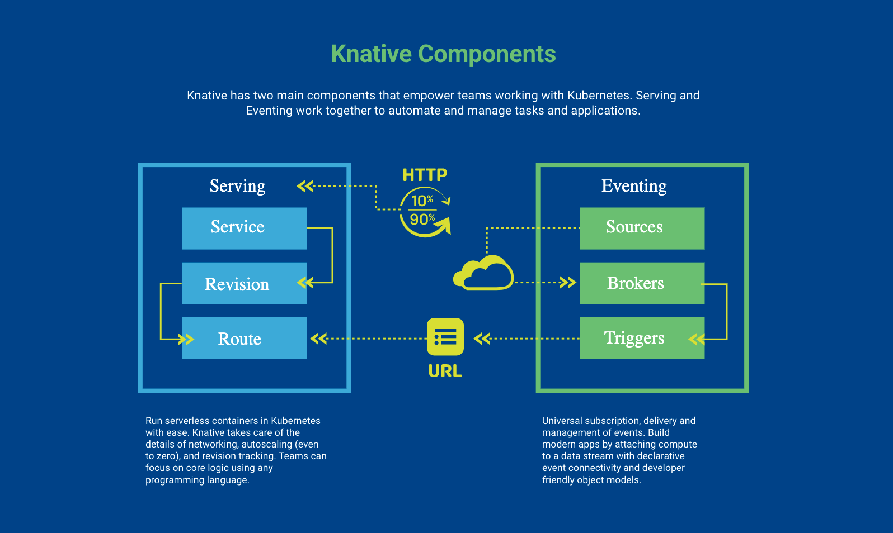

# Demo Red Hat Serverless on OpenShift ocp-serverless-demo

Voici un tutorial sur ce qu'est [Red Hat Serverless](https://www.redhat.com/en/technologies/cloud-computing/openshift/serverless)


## Red Hat Serverless, Knative sur Red Hat Openshift.

Le modèle de cloud computing sans serveur fournit aux développeurs une environnement de développement d'applications cloud native moderne pour les clouds hybrides. Serverless permet aux développeurs de se concentrer sur leur code sans se soucier de l'infrastructure. `Red Hat OpenShift Serverless` vous permet d'éviter d'être enfermé dans un seul fournisseur et permet une approche multicloud.

 [Knative](https://knative.dev/docs/) est un project Open-Source de niveau d'entreprise qui permet de construire des application Serverless et Event-Driven. `Knative` est une solution qui est plaforme agnostic pour rouler des applicaitons serverless.


### Pourquoi utiliser le Serverless.

Serverless fait référence a l'utilisation d'application et de processus qui roule dans le cloud. Serverless fonctionne en mode "as-used", ce qui veut dire que la compagnie pay seulement pour les resources qui sont utilisé par l'exécution de l'applications. Serverless avec `Knative permet plusieurs avantages:
* Abstraction Simplifier: Simplifie la création des yaml grace au Custom CRD.
* AutoScaling: Permet de scaler un applicaiton de 0 a N au besoins
* Progressive Rollout: Permet de choisir la strategy de "rollout" selon vos besoins.
* Event Integration": Permets l'intégration avec plusieurs type d'event de plusieurs source differentes.
* Handle Even: Grâce au event broker, ont peut manipuler les events
* _Kubernetes Native_ fait pour kubernetes et est extensible comme celui-ci.


### Table des matière
* [Prérequis](#prérequis)
* [Installation de Serverless](#installation)
* [Composante de Knative](#composante-de-knative)
* [Demo Knative cli](docs/knative-cli.md)
* [Demo Knative Serving](docs/knative-serving.md)
* [Demo Knative Eventing](docs/demo-consumer-producer.md)
* [Demo Kafka Streams](docs/demo-kafka-streams.md)

##### Prérequis
* Un cluster OpenShift
* Un compte admin
* Un acces au cluster par CLI
* Accès au code de ce repository
* [Optionel] Knativve client 


#### Installation

L'installation de l'opérateur Kafka, le cluster et le topic ce fait en exécutant le scrtip kustomize suivant.
```
until oc apply -k setup/overlays/demo
do
  sleep 20
done
```


#### Composante de Knative

`Knative` contain 2 composante principale. Les 2 composantes fonctionne ensemble pour automatisé et gérer les taches et applications des équipes qui travail dans un environnement cloud natif.

__Serving__ Permets de rouler des application serverless dans un monde kubernetes de façon simle, rapide et sans effort. Knative s'occupe des différent détails comme le networking, l'autoscaling ainsi que la supersion des révisions. Avec `serving` les équipes peuvent se concentrer sur la logic du code dans le languages de programmation de leur choix.

__Eventing__ Livraison, gestion et abonnement universel au évènement. `Eventing` nous permet de construire des applicaiton moderne en attachant un "compute" a un flux de données (stream).


