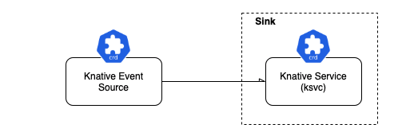
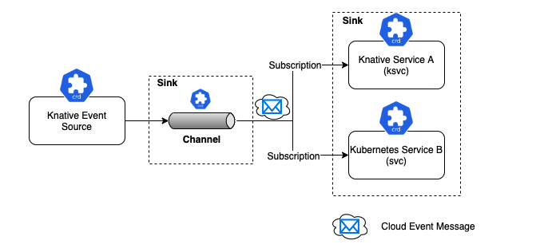
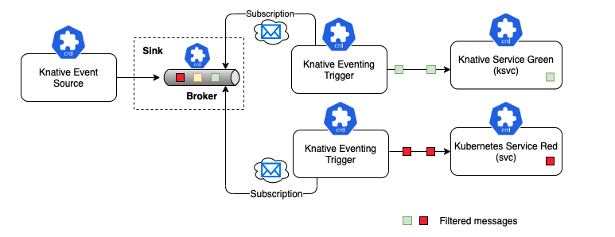
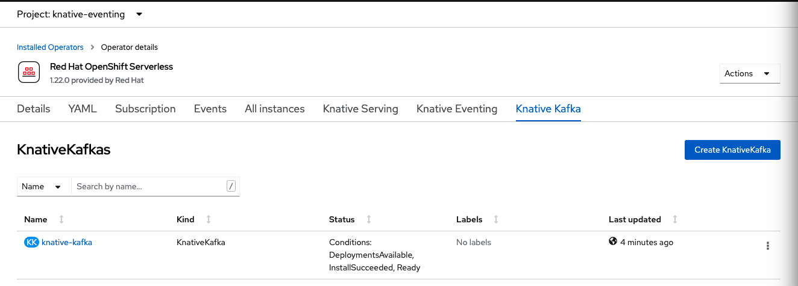
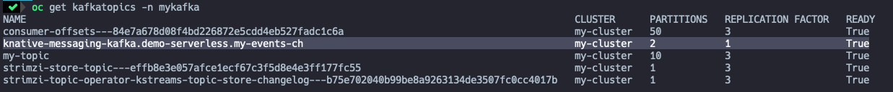
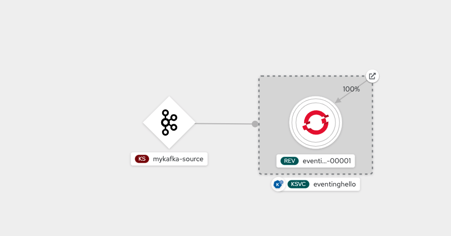

# Démonstration Knative Eventing


## Prérequis
* Installation de `Kafka` sur OpenShift. Voir [ocp-kafka-demo](https://github.com/froberge/ocp-kafka-demo) pour installation si ce n’est pas déjà fait ou si vous n’avez pas accès à un cluster `Kafka`.

## Définitions 

`CloudEvents` est une spécification pour décrire les données d'événement d'une manière commune. Un événement peut être produit par un nombre quelconque de sources (par exemple, Kafka, S3, GCP PubSub, MQTT) et en tant que développeur de logiciels, vous souhaitez une abstraction commune pour toutes les entrées d'événement.

## Modèle d'utilisation

Il existe 3 Modèles principaux d'utilisation avec Knative Eventing

__Source to Sink__
Source to Sink offre l'expérience de démarrage le plus simple avec Knative Eventing. Il fournit un seul récepteur, c'est-à-dire un service de réception d'événements, sans file d'attente, contre-pression et filtrage. La source vers le service ne prend pas en charge les réponses, ce qui signifie que la réponse du service Sink est ignorée. La responsabilité de la source de l'événement consiste simplement à transmettre le message sans attendre la réponse du récepteur.



__Channel & Subscription__
Avec le Channel & Subscription, le système Knative Eventing définit un canal, qui peut se connecter à divers backends tels que In-Memory, Kafka et GCP PubSub pour approvisionner les événements. Chaque canal peut avoir un ou plusieurs abonnés sous la forme de services Sink, qui peuvent recevoir les messages d'événement et les traiter selon les besoins. Chaque message du canal est formaté en tant que CloudEvent et envoyé plus haut dans la chaîne à d'autres abonnés pour un traitement ultérieur. Le modèle d'utilisation Channel & Subscription n'a pas la capacité de filtrer les messages.



__Broker and Trigger__
Le broker and trigger est similaires au channel & subscription, sauf qu'il prend  en charge le filtrage des événements. Le filtrage des événements est une méthode qui permet aux abonnés de manifester un intérêt pour un certain ensemble de messages qui transitent vers le courtier. Pour chaque courtier, Knative Eventing créera implicitement un channel Knative Eventing. Le trigger s'abonne au broker et applique le filtre sur les messages de son broker abonné. Les filtres sont appliqués sur les attributs Cloud Event des messages, avant de les livrer aux Sink Services (abonnés) intéressés.




## Installation de `Knative Kafka`

* Pour commencer nous devons faire une instance de Knative Kafka
    ```
    oc apply -f manifest/k8s/eventing/knative-kafka.yaml
    ```

    

* Modifions le type de channel pour Knative. 
Par défaut les channel Knative sont InMemory, donc on doit lui dire de le mettre en Kafka pour notre projet. Pour ce faire, nous allons modifier le _default-channel-config._
    ```
    oc apply -f manifest/k8s/eventing/default-channel-config.yaml
    ```

* Création d'un channel Knative. Comme le channel est de type Kafka, il va créer le kafka topic qui correspond.
    ```
    oc apply -f manifest/k8s/eventing/default-kafka-channel.yaml
    ```
    __Validation__
    Le channel Knative
    ```
    oc get -n demo-serverless channels
     ```
     ```
     NAME           URL                                                                AGE     READY   REASON
    my-events-ch   http://my-events-ch-kn-channel.demo-serverless.svc.cluster.local   3h17m   True
    ```

    Le channel kafka
    ```
    oc get -n demo-serverless kafkachannels
    ```
    ```
    NAME           READY   REASON   URL                                                                AGE
    my-events-ch   True             http://my-events-ch-kn-channel.demo-serverless.svc.cluster.local   7m35s
    ```

    Le topic
    ```
    oc get kafkatopics -n mykafka
    ```
    

:construction: __CLEAN UP__
```
oc -n demo-serverless delete  channels.messaging.knative.dev my-events-ch
```
---
    
## Connecter une source Kafka a un Sink

On sait maintenant que notre infrastructure fonctionne, on peut maintenant connecter un `Knative Serving` service à notre Kafka.

* Deployer le service.
        ```
        oc apply -f manifest/k8s/eventing/eventing-hello-sink.yaml
        ```

* Valider la création du service.
    ```
    oc get ksvc -n demo-serverless
    ```

    ```
    NAME            URL                                                                                     LATESTCREATED         LATESTREADY           READY   REASON
    eventinghello   https://eventinghello-demo-serverless.apps.cluster-nrthl.nrthl.sandbox140.opentlc.com   eventinghello-00001   eventinghello-00001   True
    ```

* Regarger les logs du service avec stern
    ```
    stern eventinghello -c user-container
    ```

:warning: Assurez-vous que le topique, my-topic existe. Sinon voir  [ocp-kafka-demo](https://github.com/froberge/ocp-kafka-demo) pour comment créer le topic

* Création d'une source Kafka
    ```
    oc apply -f manifest/k8s/eventing/kafka-source.yaml
    ```

    

* Tester
    ```
    oc -n mykafka run kafka-producer -ti \
     --image=quay.io/strimzi/kafka:0.26.1-kafka-3.0.0 \
     --rm=true --restart=Never \
     -- bin/kafka-console-producer.sh \
     --broker-list my-cluster-kafka-bootstrap:9092 \
     --topic my-topic
    ```
    
    _Au prompt on peut rentrer les messages qu'on l’on veut._

* Pour voir ce qui se passe dans le sink, assurer vous d’avoir un terminal qui roule le stern sur les logs comme mentionné plus haut.
___

## Auto Scaling avec Kafka

Maintenant, faisons un test pour démontrer le auto-scalling si il y a trop de messages qui entre.

* Deployer une application qui va agir comme un spammer.
    ```
    oc -n mykafka run kafka-spammer \
    --image=quay.io/rhdevelopers/kafkaspammer:1.0.2
    ```

* Une fois l'application déployée, entrer dans le pod
    ```
    oc -n mykafka exec -it kafka-spammer -- /bin/sh
    ```

* Spammer l'application
    ```
    curl localhost:8080/3
    ```

    __Ceci devrait forcer l'application eventinghello a scale up pods__
    ```
    oc get pods -n demo-serverless -w
    ```


:eyeglasses: Vous pouvez voir le scale up en regardant les pods au niveau du command line ou dans l'interface web de OpenShift.

:construction: __CLEAN UP__
```

oc delete -n mykafka pod kafka-spammer
oc delete -n demo-serverless  -f manifest/k8s/eventing/kafka-source.yaml
oc delete -n demo-serverless  -f manifest/k8s/eventing/eventing-hello-sink.yaml
```
---