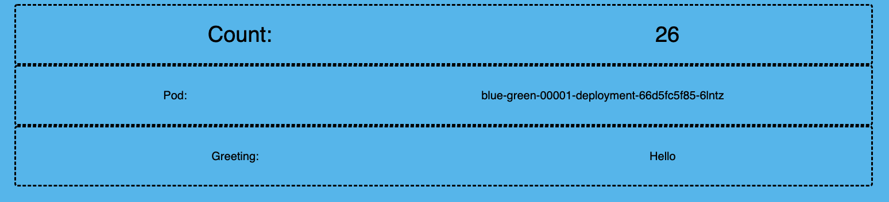
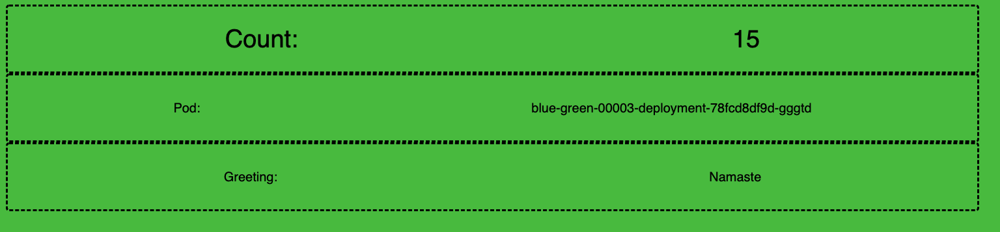

# Démonstration  Serving


## Deploiment d'un service

* Deploiment _kn service create [SERVICE_NAME] --image [IMAGE]_
    ex: Déployment du service greeting existant.
    ```
    oc apply -f manifest/k8s/serving/greeter-svc.yaml    
    ```

* Récupérons url du service.
    ``` 
    export SVC_URL=`oc get rt greeter -o jsonpath={.status.url`
    ```

* Tester le service.
    ```
    curl $SVC_URL
    ```
    Result
    ```
    Hi  greeter => '9861675f8845' : 1
    ```

* List les elements Knative avec oc client.
    * les services
    ```
    oc get services.serving.knative.dev greeter
    ```
    * La route
    ```
    oc get routes.serving.knative.dev greeter
    ```
    * Les revisions
    ```
    oc get rev --selector=serving.knative.dev/service=greeter --sort-by="{.metadata.creationTimestamp}"
    ```

:construction: __CLEAN UP__
```
oc delete services.serving.knative.dev greeter
```
---

## Distribution du traffic

Knative, envoi toujours le traffic vers la dernière révision, mais c'est possible de modifier ceci et de diviser le traffics entre les révision disponible.


:exclamation: Pour les besoins de cette demo nous allons utilisé des images déjà construite.

---
## Deploiement Blue/Green 

* Commençons par déployer un service.
```
 oc apply -f manifest/k8s/serving/blue-green-yaml
```

* Allons cherche la route
    ```
    oc get routes.serving.knative.dev blue-green -n demo-serverless
    ```

* Copier la route et la mettre dans un Browser



* Déployer un deuxieme revision
    ```
    oc apply -f manifest/k8s/serving/blue-green-yaml
    ```

* Rafraichir le browser


* Vérifier les révision
```
kn revision ls
```
```
NAME               SERVICE      TRAFFIC   TAGS   GENERATION   AGE   CONDITIONS   READY   REASON
blue-green-00002   blue-green   100%             2            21s   4 OK / 4     True
blue-green-00001   blue-green                    1            66s   4 OK / 4     True
```

* Mettre un tag sur une révision

    Tag blue.
    ```
    kn service update blue-green --tag=blue-green-00001=blue
    ```

    Tag green
    ```
    kn service update blue-green --tag=blue-green-00002=green
    ```

    ```
    NAME               SERVICE      TRAFFIC   TAGS    GENERATION   AGE     CONDITIONS   READY   REASON
    blue-green-00002   blue-green   100%      green   2            3m18s   4 OK / 4     True
    blue-green-00001   blue-green             blue    1            4m3s    3 OK / 4     True
    ```

* Appliquer le Blue/Green pattern
    ```
    kn service update blue-green --traffic blue=70,green=30
    ```
    ```
    NAME               SERVICE      TRAFFIC   TAGS    GENERATION   AGE     CONDITIONS   READY   REASON
    blue-green-00002   blue-green   30%       green   2            5m10s   4 OK / 4     True
    blue-green-00001   blue-green   70%       blue    1            5m55s   3 OK / 4     True
    ```

:eyeglasses: Rafraichier le browser et observéser le changement de couleur et ce qui arrive sur OCP.

:construction: __CLEAN UP__
```
oc delete services.serving.knative.dev blue-green
```
---

## Scaling

Par default,  `knative` permets 100 concurrent request par pod. Pour cette exampe nous allons le diminuer a 10, et voir comment il scale up and down.

* Déployons le service
```
oc apply -f manifest/k8s/serving/prime-generator.yaml
```

* Extractons URL
```
export SVC_URL=$(kn service describe prime-generator -o url)
```

* dans un terminal surveillong le pods du service
```
    oc get pods -n demo-serverless -w
```

* Dans un autre terminal overload le service
```
hey -c 50 -z 10s "$SVC_URL/?sleep=3&upto=10000&memload=100"
```

:warning: On peut aussi lui dire a Knative de scaler par plus 1 pods a la fois avec la valeur  autoscaling.knative.dev/minScale:


:construction: __CLEAN UP__
```
oc delete services.serving.knative.dev 
```
---
